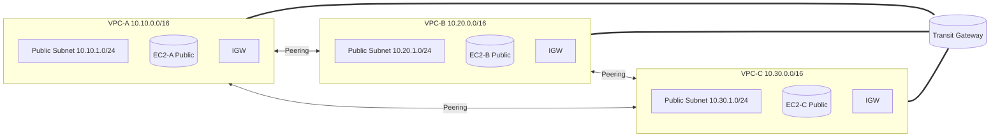

# AWS Networking Lab — VPC Peering vs. Transit Gateway (TGW)

This lab deploys **three VPCs** (A: 10.10.0.0/16, B: 10.20.0.0/16, C: 10.30.0.0/16) each with a **public subnet** and a small EC2 host.  
You will connect them first with **VPC Peering** (point‑to‑point) and then with an **AWS Transit Gateway** (hub‑and‑spoke), and compare behavior.

> ⚠️ **Costs**: TGW has hourly + data processing charges. Keep the lab short and **delete the stack** when finished.

---

## 🗺️ Architecture Diagram



---

## 📦 What gets deployed

- **VPCs**: A(10.10.0.0/16), B(10.20.0.0/16), C(10.30.0.0/16)
- One **public subnet** per VPC (10.x.1.0/24), **IGW**, **Route Table**.
- One **EC2** per VPC (Amazon Linux 2023) with a tiny web page and common tools.
- **Security Groups**: allow **HTTP(80)** from anywhere, **SSH(22)** from **your IP**, **ICMP** within lab CIDRs.
- **VPC Peering**: A↔B, B↔C, A↔C with proper routes in each VPC route table.
- **Transit Gateway**: hub with **attachments** to all three VPCs; TGW route table enables **propagation** and **associations**. VPC route tables include routes to other VPCs via TGW.

You can **toggle** what is created via parameters:
- `EnablePeering=true/false`
- `EnableTGW=true/false`

Default is **both enabled** so you can compare side‑by‑side.

---

## 🔧 Parameters

- `KeyName` — EC2 key pair for SSH
- `YourIpCidr` — your IP in CIDR, e.g., `203.0.113.10/32`
- `InstanceType` — default `t3.micro`
- `EnablePeering` — default `true`
- `EnableTGW` — default `true`

---

## 🚀 Deploy

1. AWS Console → **CloudFormation** → **Create stack** → *With new resources*.  
2. Upload `cloudformation/network-peering-vs-tgw.yaml`.  
3. Set parameters (use your KeyPair and IP).  
4. Wait for **CREATE_COMPLETE** and open **Outputs** for the three public IPs:
   - `APublicIP`, `BPublicIP`, `CPublicIP`

---

## 🧪 Lab Exercises

### 1) Verify basic connectivity (per VPC)
From your laptop:
```bash
curl http://<APublicIP>
curl http://<BPublicIP>
curl http://<CPublicIP>
```

SSH into **A** and try to reach **B** and **C** by private IPs:
```bash
ssh -i /path/to/key.pem ec2-user@<APublicIP>

# Discover private IPs in console or via the instance metadata / CLI
ping -c 3 10.20.1.10     # EC2-B private (example)
curl http://10.20.1.10
ping -c 3 10.30.1.10     # EC2-C private (example)
curl http://10.30.1.10
```

> With **peering (full mesh)**, A↔B, B↔C, A↔C will work if the **routes** are present. **Transitive routing is NOT allowed** via peering.

### 2) Demonstrate peering is not transitive
Temporarily **delete the A↔C peering route** in A’s route table (leave A↔B and B↔C).  
- Try `curl 10.30.1.10` from A again.
- **Expected**: Fails via peering because A cannot go **through B** to reach C. Peering is **not transitive**.

### 3) Demonstrate TGW as hub‑and‑spoke
With **TGW enabled**, even if you **remove** direct A↔C peering routes, traffic can flow **A → TGW → C** (if VPC route tables have TGW routes and TGW route table propagations/associations are in place).  
- From A: `curl 10.30.1.10` should **succeed** via **TGW**.  
- Check **TGW route table** in the console to see **propagated** routes.

> You can also **disable peering** (`EnablePeering=false`) and re‑deploy to see TGW‑only behavior.

---

## 🧭 Where to look

- **VPC → Route tables**: look for destination CIDRs of the *other* VPCs.  
  - With **peering**: target is **pcx‑...** (the peering).  
  - With **TGW**: target is **tgw‑attach**/**tgw‑...**.  
- **VPC → Peering connections**: A↔B, B↔C, A↔C should be **Active**.  
- **Transit Gateway → Route tables**: see **propagations** and **associations** for all three attachments.

---

## 🆘 Troubleshooting

- **Can’t SSH** → ensure `YourIpCidr` matches your current IP; some networks block outbound 22.  
- **Peering routes not working** → confirm **peering status is Active** and **each VPC** has routes to the other’s CIDR.  
- **No transitive path via peering** → that’s expected; peering is not transitive. Use **TGW**.  
- **TGW not routing** → verify each VPC has **static routes to the other VPC CIDRs** pointing to the **TGW**; check **TGW route table propagation/association**.  
- **Stack delete stuck** → TGW attachments/peering may take time; retry deletion after a minute.

---

## 🧹 Cleanup

- CloudFormation → select the stack → **Delete**.

---

## 📁 Repo Layout

```
cloudformation/
  network-peering-vs-tgw.yaml
docs/
  architecture.md
.github/workflows/
  cfn-validate.yml
README.md
LICENSE
.gitignore
```
