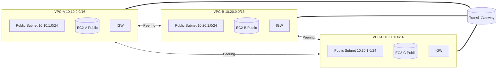

# Architecture

```mermaid
flowchart LR
  subgraph VPC_A["VPC-A 10.10.0.0/16"]
    A_PUB["Public Subnet 10.10.1.0/24"]
    A_EC2[(EC2-A Public)]
    A_IGW[IGW]
  end

  subgraph VPC_B["VPC-B 10.20.0.0/16"]
    B_PUB["Public Subnet 10.20.1.0/24"]
    B_EC2[(EC2-B Public)]
    B_IGW[IGW]
  end

  subgraph VPC_C["VPC-C 10.30.0.0/16"]
    C_PUB["Public Subnet 10.30.1.0/24"]
    C_EC2[(EC2-C Public)]
    C_IGW[IGW]
  end

  %% Peering (full mesh for demo)
  VPC_A <-- Peering --> VPC_B
  VPC_B <-- Peering --> VPC_C
  VPC_A <-- Peering --> VPC_C

  %% TGW hub
  TGW[(Transit Gateway)]
  VPC_A === TGW
  VPC_B === TGW
  VPC_C === TGW
```
